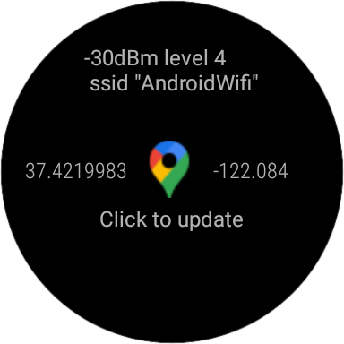
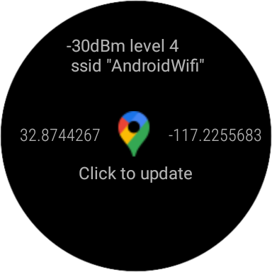

# CSE218 - Assignment 3
## WearOs app - Location and Wifi tracking
### Authors: Balaji Muthazhagan (UCSD), Shikha Dixit (UCSD)
___
The app has the following functionalities:
* Shows current latitude and longitude
* Shows current Wifi strength and SSID

  
The main functionality of the app is defined in `main/wear/src/main/java/CSE218/MainActivity.java`
   
The app has the following screens:   

<b>1) Initial screen</b>  
  

<b>2) In progress screen</b>  
  

 <b>3)Result screen</b>  

   
Updating the location to current area of residence on the emulator, we get:  

